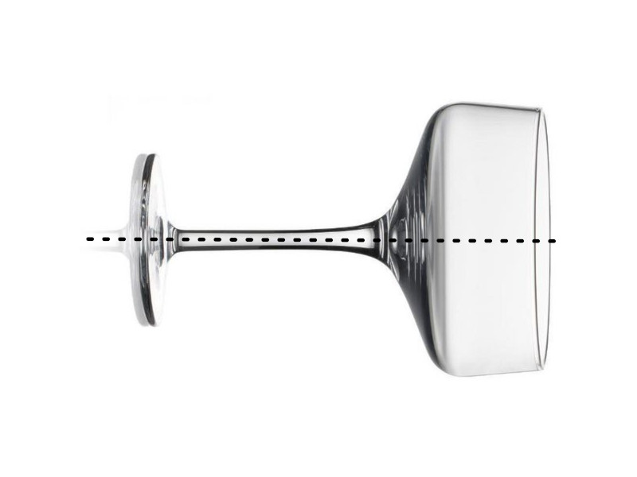

# Homework 4

## Solution

See file [champagne.R](https://github.com/ptds2023/hw4_solution/blob/dcb9e8e0b8e808264713c3a35cbf7cd4689f065e/champagne.R)

```r
# Part I: Modeling

# Modeling the Champagne glass
# non-vectorized function:
g <- function(x) {
  if(x < 0) {
    return(0)
  } else if (x < .5) {
    return(15)
  } else if (x < 10) {
    return(2)
  } else if (x < 15) {
    return(8 * log2(x - 9) + 2)
  } else if (x <= 20) {
    return(8 * log2(6) + 2)
  } else {
    return(0)
  }
}

g(c(1,2))

# i. 
f1 <- function(x) {
  y <- double(length(x))
  for(i in seq_along(y)) {
    y[i] <- g(x[i])
  }
  y
}

# ii.
library(purrr)
f2 <- function(x) map_dbl(x, g)

# iii. using vapply
f3 <- function(x) vapply(X = x, FUN = g, FUN.VALUE = double(1))

# iv.
f4 <- Vectorize(g, "x")

# comparison
set.seed(123)
x <- runif(1000, 0, 20)
library(microbenchmark)
microbenchmark(f1(x), f2(x), f3(x), f4(x), times = 100)

# a vectorized version of f
f5 <- function(x) 15 * (0 <= x & x < .5) + 2 * (.5 <= x & x < 10) + 
  (8 * log2(abs(x - 9)) + 2) * (x >= 10 & x < 15) + (8 * log2(6) + 2) * (x >= 15 & x <= 20) 

# note: we use log2(abs(x - 9)) to avoid problems with evaluation of log2 with negative values.

microbenchmark(f1(x), f2(x), f3(x), f4(x), f5(x), times = 1000)

# Remark: the vectorized implementation is clearly the most efficient however not the easiest to read.

f <- function(x) {
  structure(15 * (0 <= x & x < .5) + 2 * (.5 <= x & x < 10) + 
              (8 * log2(abs(x - 9)) + 2) * (x >= 10 & x < 15) + (8 * log2(6) + 2) * (x >= 15 & x <= 20) ,
            class = "champagne")
}

plot.champagne <- function(x, from=0, to=20, ...) {
  curve(x, from=from, to=to, ...)
}

x <- f(1)
plot(x)

# Computing the volume of Champagne glass
I_approx <- integrate(f, lower = 10, upper = 20)$value
I <-  4 * (-10 + 22 * log(6) + log(32)) / log(2)
abs(I - I_approx)

V_approx <- pi * integrate(function(x) f(x)^2, lower = 10, upper = 20)$value
V <- pi * 8 * (80 + 5*log(2)^2 + 88*log(6)^2 + 4 * (11 * log(6) - 5) * log(2) - 96 * log(6)) / log(2)^2
abs(V - V_approx)

content <- V / 1000

# What is the value of such that 0.2 liters is poured in the glass? 
fit1 <- uniroot(function(y) pi * integrate(function(x) f(x)^2, lower = 10, upper = y)$value / 1000 - 0.2, lower = 10, upper = 20)
fit1$root

fit2 <- optimize(function(y) (pi * integrate(function(x) f(x)^2, lower = 10, upper = y)$value / 1000 - 0.2)^2, lower = 10, upper = 20)
fit2$minimum

# Organizing a party where Champagne is served
n <- 1e4 # number of party
set.seed(123L)
G <- rpois(n, lambda = 50) # number of guest per party
D <- sapply(G, function(x) sum(rpois(x, lambda = 1.5))) # number of glasses per party
simu_b <- function(x) {
  b <- rnorm(x, mean = 11.15, sd = 0.5)
  while(any(b<=10)) b[b<=10] <- rnorm(sum(b<=10), mean = 11.15, sd = 0.5)
  b
}
B <- lapply(D, simu_b) # quantity poured by the barman
vol <- function(b) pi * integrate(function(x) f(x)^2, lower = 10, upper = b)$value / 1000
volV <- Vectorize(vol, "b")
total_liters <- sapply(B, function(x) sum(volV(x)))
total_bottles <- sapply(total_liters, function(x) ceiling(x / .75))

boxplot(total_liters)
barplot(table(total_bottles))
quantile(total_bottles, probs = .99)
```

## Objectives :full_moon_with_face:

The objectives of this homework assignment are as follows:

- 📏 Develop a deep understanding of **mathematical modeling** and **calculus** in R, particularly focusing on the disk integration method for calculating volumes.
- 🖥️ Enhance skills in **vectorized computations** in R, comparing different approaches for performance optimization.
- 🧪 Strengthen understanding of **statistical distributions** and their application in simulations, such as Poisson and Normal distributions.
- 💻 Master the use of **R programming tools** like `integrate`, `uniroot`, `optimize`, and various functions from the `purrr` package.
- 📦 Develop competency in **R package development**, including function documentation, testing, and version control with GitHub.

## Deadline :alarm_clock:

Submit the homework by Wednesday, 29th November 2023 at 23:59 by pushing to the dedicated repository.

Based on the example and the content of your new homework assignment, here are the requirements:

## Requirements :warning:

This homework **must** be completed using the specified GitHub template and must adhere to the following requirements:

- 🔄 Use consistent and descriptive commit messages throughout the development process.
- 📂 Your GitHub repository must include at least:
  - A **README.md** file providing a comprehensive overview of the homework, including objectives, methodology, and how to run the code.
  - A well-organized issue tracker, with at least one issue that includes a **TO DO** list related to the project.
  - At least one pull request, showcasing the process of reviewing and merging code into the main or master branch.
- 🔀 Create and work on a separate branch for development, only merging it with the main or master branch via a pull request.
- 📈 If the solution involves multiple **R scripts or RMarkdown files**, they should be clearly numbered or named to indicate their purpose and the order in which they should be executed or read.
- 🖥️ Provide detailed instructions in the `README.md` on how to install and use the R package, including any dependencies and how to run the tests.

---

## Content :rocket:

### Computing the volume of a glass of Champagne :champagne:

Consider a barman working in a cocktail bar that would like to compute the volume of Champagne poured in a Champagne glass.


In order to compute the volume of the cup of the Champagne glass, the barman proposes to use the [disk integration method](https://en.wikipedia.org/wiki/Disc_integration) and to represent the glass as a [solid of revolution](https://en.wikipedia.org/wiki/Solid_of_revolution). More precisely, the barman, who has some notion of calculus, represents the side cut of half of the Champagne glass placed horizontally on an imaginary x-axis as the following piecewise function, $f:\mathbb{R}\to\mathbb{R}$,

$$
x \mapsto
\begin{cases}
0, & \text { if } \quad x < 0, \\
15, & \text { if } \quad 0 \leq x < 0.5, \\
2, & \text { if } \quad 0.5 \leq x < 10, \\ 
8\mathrm{log}_2(x-9)+2, & \text { if } \quad 10 \leq x < 15, \\
8\mathrm{log}_2(6)+2, & \text { if } \quad 15 \leq x \leq 20, \\
0, & \text { if } \quad x > 20,
\end{cases}
$$

where $\mathrm{log}_2$ is the binary logarithm. The function $f$ is illustrated in the figure below.




### Part I: Modeling

#### Modeling the Champagne glass

Implement a _non-vectorized_ version of $f$. Verify it is not _vectorized_. Propose four different implementations that _vectorizes_ the _non-vectorized_ function:

1. by using a `for` loop,
2. by using one of the `map` function of `purrr`,
3. by using one of the `apply` functions (`lapply`, `vapply`, `sapply`, `mapply`, ...),
4. by using `Vectorize`.

Compare the performance of the four implementations using `microbenchmark` or `bench`. Which implementation is the most efficient? Make a graph of the time taken for $100$ evaluations of these implementations using an input of increasing size, from $10$ to $10^4$ (mind the time units). Comment on the results.

Propose a vectorized version of $f$ (without using the approach in 1., 2., 3. or 4.) and compare the performance of this implementation with the other ones.

For the rest of the exercise, select the most efficient implementation of $f$.

Propose an implementation that makes a graph with the function `curve` when using the `plot` method on an evaluation of $f$.

#### Computing the volume of Champagne glass

The disk method for computing the volume of a solid of revolution using a Riemann integral involves "summing" the volumes of thin disks along the axis of revolution. If the axis of rotation is "horizontal" (the $x$-axis), then, for all $a,b\in\mathbb{R}$, $a < b$, the volume formed by rotating the area under the curve of $f$ is given by:

$$
V:=\pi\int_a^b[f(x)]^2dx,
$$

where $f$ is non-negative and continuous on $[a,b]$.

Let $I:=\int_a^bf(x)dx$. Remark that when Champagne is poured in the glass, it does not go to the bottom of the glass ($x=0$) but it stays at $x=10$. Assume $I$ and $V$ exist for $a\geq10$.

1. Compute $I$ using `integrate` for $[a,b]=[10,20]$. Compare the result with the true value:

$$
\frac{4 \cdot (-10 + 22 \log(6) + \log(32))}{\log(2)}
$$

2. Compute $V$ using `integrate` for $[a,b]=[10,20]$. You should use an anonymous function to make this computation. Compare the result with the true value:

$$
\frac{8 \pi  \left(80+5 \log ^2(2)+88 \log ^2(6)+4 (11 \log (6)-5) \log (2)-96 \log (6)\right)}{\log ^2(2)}.
$$

Assuming the units defining $f$ are in centimeter, what is the content in liters of a full glass of Champagne? The answer might of course not be realistic.

What is the value of $b$ such that 0.2 liters is poured in the glass? To answer this question:

1. Solve this problem using the function `uniroot`.

2. Solve this problem using the function `optimize`. Note that by default `optimize` tries to minimizes the function passed as argument.

#### Organizing a party where Champagne is served

Suppose you would like to organize a party where you plan to serve Champagne in the glasses described above. You would like to estimate how many bottles of Champagne you should order for the party (assume a bottle is 0.75 liter). You are not sure of: (a) how many guests will join the party,  (b) how many glasses they might drink and (c) what quantity will be poured in the glasses. Assume the following:

- There are $G$ guests, where $G\sim\text{Poisson}(\lambda = 50)$;
- A guess drinks $D$ glasses, where $D\sim\text{Poisson}(\lambda = 1.5)$;
- A barman typically fills the glass in the interval $[a,b]$ where $a=10$ and $b\sim\text{Normal}(11.15, 0.5^2)$ such that $b>a$.

Simulate 10,000 parties using the above assumption. For each party, compute the total number of liters of Champagne that is served and the total number of bottles (an open bottle not entirely served, is a bottle). Make a boxplot for the total number of liters and an histogram/barplot for the total number of bottles. Your guests will be satisfied if there is enough Champagne. How many bottles will you need to satisfy your guests with a 99\% chance?

---

### Part II build an R package

For this problem, we simply wrap functions of __Part I__ into a package:

- Create a package `champagneUSERNAME` (where `USERNAME` is your GitHub username without special characters) in RStudio: _File -> New Project... -> New Directory -> R Package_.
- Create a new GitHub repo `champagneUSERNAME` (where `USERNAME` is your GitHub username without special characters) in the `ptds2023` organization and synchronize it with your "initial" package.
- Copy the functions from the previous problem into the `R/` folder. Commit.
- Document all the functions using `roxygen2` comments. Use `devtools::document()` to generate help files afterwards. Do not forget to specify `@export` in `roxygen2` comments to export functions into `NAMESPACE` (make it visible outside the package). Commit. You should at least have the following tags:

```r
#` @title
#` @authors
#` @param (or @params)
#` @return
#` @examples (or @example)
```

- Fill in the `DESCRIPTION` file as much as possible. Commit.
- Clean up the auto-generated file `hello.R` and `hello.Rd`, from `R/` and `man/`, respectively. Commit.
- Remove `NAMESPACE` file, since it was not auto-generated by `roxygen2` (and, therefore, prevents `roxygen2` to overwrite `NAMESPACE`). Then, evoke the command `devtools::document()` to generate it. Commit.

At the end of each step, please, do not forget to commit with a meaningful message.

Note that if you use other packages, you have to specify it in `DESCRIPTION` file in the `Imports` section. To use the function from a package you have to specify its namespace. That is, use `pkg::function()` for a function.

At this step, you should verify if everything works well. You need to `Install and Restart` (in `Build` tab) and try to run `f()` (you may name it differently), as well as look at the help file by `?f`.

- Add automatic tests with `testthat`. You should at least have one test per function. For example, make sure that you obtain a given error when a "wrong" input is provided. You should at least use the test performed in the previous part of the exercise.
- Correct every errors, warnings and notes obtained from `devtools::check()` (or equivalently clicking on `Check`).
- Add Github action to make automatic checks for at least Windows, MAC and Ubuntu OS.
- Create a website with `pkgdown`. Build it and create Github action.
